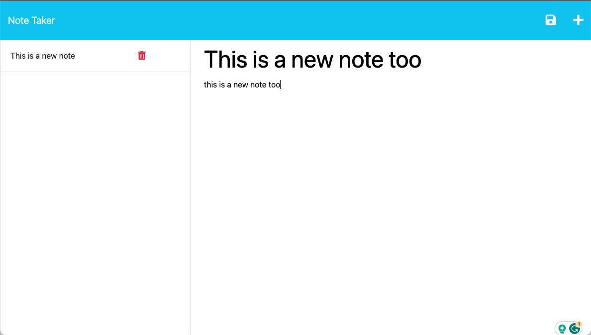

# Express.js Challenge: Note Taker
This project introduces "Note Taker," an app designed for creating, storing, and retrieving notes. Powered by Express.js on the backend, it manages note data via a JSON file. Furthermore, seamless deployment on Heroku is part of the project scope.

## Table of Contents
* [Description](#description)
* [Install](#install)
* [Use](#use)

## Description
Experience efficient note-taking with this application that seamlessly meets evaluation criteria. Upon opening the Note Taker, a user-friendly landing page greets you, featuring a prominent link to access your notes: 


With just a click, you're transported to a comprehensive notes page, where existing notes are elegantly displayed in the left-hand column. Simultaneously, the right-hand column eagerly awaits your new note's title and text input.


Creating new notes easily just adding your note's title and content, a Save icon appears at the top of the page, ready to preserve your notes. Tapping this icon stores your creation alongside your existing notes, making retrieval easy.



Interaction is intuitive. Selecting an existing note in the left-hand column instantaneously brings its contents to the forefront in the right-hand column, making updates and edits a seamless experience. For a fresh note, simply click the Write icon in the navigation bar, and voilà—empty fields await your new note's title and text.


## Install
To verify Node.js installation, type "node -v" in your command line. If Node is absent, access the Node.js website for installation. Subsequently, clone this repository to your machine. Run the following line of code in your terminal to install all the needed packages: 

```
npm i
```


## Use
After installing all the required packages, launch your terminal and execute the following command in the command line:
```
npm start
```
By executing this command, the server will start, and you can access the page at localhost:3300. To stop the server, simply enter "control + c" in your terminal.
